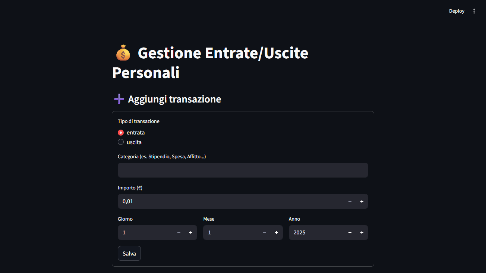
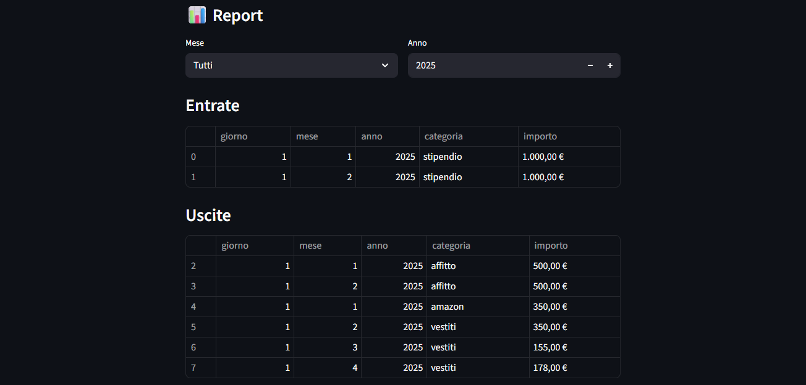
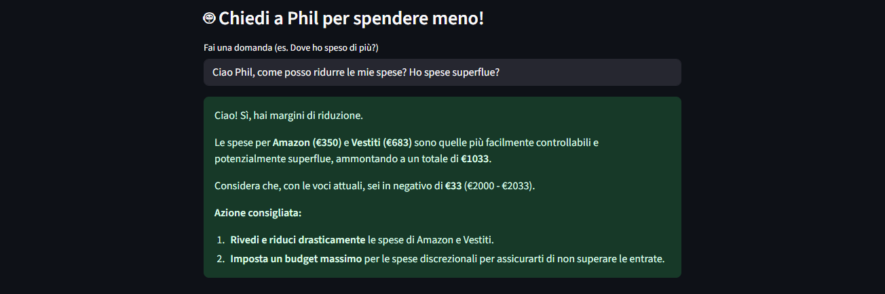

# 💰 Gestione Entrate/Uscite Personali

Una semplice applicazione **Streamlit + SQLite** per gestire le proprie **entrate e uscite mensili**, con la possibilità di:

- Inserire transazioni (entrate/uscite) con data e categoria
- Filtrare per mese e anno
- Visualizzare entrate, uscite e saldo
- Resettare il database con un click
- Chiedere consigli ad un piccolo **LLM integrato** (configurabile)

---

## ⚙️ Installazione

Ci sono due modi per installare le librerie necessarie:

---

### 1️⃣ Usando requirements.txt

1. Clona il repository:
```bash
git clone https://github.com/tuo-utente/tuo-repo.git
cd tuo-repo
```

2. Crea un ambiente virtuale (consigliato):
```bash
python -m venv .venv
source .venv/bin/activate  # Linux/Mac
.venv\Scripts\activate     # Windows
```

3. Installa le librerie:
```bash
pip install -r requirements.txt
```
▶️ Per lanciare l'app:
```bash
streamlit run spese_app/app.py
```

---

### 2️⃣ Usando pyproject.toml

Se vuoi installare il progetto come **pacchetto Python** (editable):

1. Clona il repository:
```bash
git clone https://github.com/tuo-utente/tuo-repo.git
cd tuo-repo
```

2. Crea un ambiente virtuale (consigliato):
```bash
python -m venv .venv
source .venv/bin/activate  # Linux/Mac
.venv\Scripts\activate     # Windows
```

3. Installa il pacchetto:
```bash
pip install -e .
```

> Nota: In questo modo puoi importare `spese_app` direttamente in Python e modificare il codice senza reinstallare il pacchetto.

▶️ Per lanciare l'app:
```bash
python -m streamlit run spese_app/app.py
```

---

## 🔑 Configurazione API Gemini

1. Vai su [Google AI Studio](https://aistudio.google.com/) e genera una chiave API.  
2. Crea un file `.env` nella root del progetto:  

```ini
# .env
GEMINI_API_KEY=INSERISCI_LA_TUA_CHIAVE
```

---

## 🖥️ Funzionalità

- **Aggiunta transazioni** (entrate/uscite con data e categoria)  
- **Report** con tabella entrate/uscite e calcolo del saldo  
- **Consulente AI (Gemini)** per rispondere a domande come:  
  - *"Dove ho speso di più?"*  
  - *"Qual è la categoria con più uscite questo mese?"*  
- **Reset Database** con un click  

---

## 📊 App Screenshot

*(Esempio dell' interfaccia con Streamlit)*  





---

## 📁 Struttura progetto

```txt
spese_app/
│── app.py          # Main Streamlit app
│── db.py           # Gestione database SQLite
│── llm.py          # Wrapper per Gemini API
│── __init__.py
.gitignore           # File ignorati in Git
requirements.txt     # Dipendenze Python
README.md            # Documentazione
```

---


